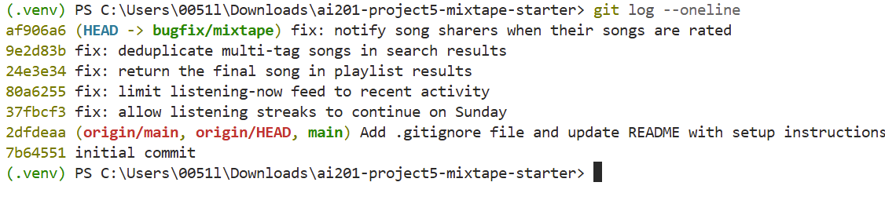

# Mixtape Bug Hunt Submission

## AI Usage

I used AI as a debugging and code-navigation assistant during this project. It helped me understand the structure of the unfamiliar Flask codebase, identify which service files were connected to each reported issue, and explain specific Python behavior such as how `datetime.weekday()` represents Sunday.

I also used AI to help interpret pytest failure messages and compare the expected behavior with the actual implementation. For example, AI helped explain why the Sunday streak test failed and why using `songs[:-1]` removed the last song from a playlist.

I did not rely only on the AI’s conclusions. I verified the issues by reading the relevant source files, running the provided pytest tests, making targeted changes, and rerunning the tests. I also checked the final project using the complete test suite, which passed all 13 available tests.

## Codebase Map

- `app.py` creates and configures the Flask application, initializes SQLAlchemy, and registers the route blueprints.
- `models.py` defines the database models used by Mixtape, including users, songs, playlists, ratings, listening events, friendships, tags, and notifications.
- `routes/` contains the Flask endpoints. The route files receive requests, validate or read request data, call service functions, and return JSON responses.
- `services/` contains the main business logic of the application. The reported bugs were mainly located in the streak, feed, playlist, search, and notification service files.
- `tests/` contains pytest tests for the streak, playlist, and search features.
- `seed_data.py` creates the local database and inserts sample users, songs, playlists, listening activity, and other data for testing.
- `requirements.txt` lists the Python packages needed to run the project.

### Example Data Flow — Retrieving Playlist Songs

When a playlist endpoint receives a request, the route calls `get_playlist_songs()` in `services/playlist_service.py`. The service queries the playlist-song association records, orders them by their stored position, retrieves the related `Song` objects, converts each song into a dictionary, and returns the resulting list to the route. The route then sends the list back to the client as JSON.

### Pattern I Noticed

The project separates HTTP handling from business logic. Route files mainly handle incoming requests and outgoing responses, while the service files contain the actual application rules and database queries. This made debugging easier because I could start from the user-facing feature and follow its route into the appropriate service file.

## Issue #1 — My Listening Streak Keeps Resetting

### How I reproduced it

I ran the streak test file with:

```powershell
.\.venv\Scripts\python.exe -m pytest tests/test_streaks.py -v
```

Four tests passed, but `test_streak_increments_on_sunday` failed.

The test recorded one listening event on Saturday, June 15, 2024, followed by another event on Sunday, June 16, 2024. The streak was expected to increase from 1 to 2, but the actual value remained 1.

The failure message showed:

```text
E assert 1 == 2
```

This confirmed that consecutive listening activity was handled incorrectly when the second day was Sunday.

### How I found the root cause

I started from the failing test in `tests/test_streaks.py` and followed the imported function into `services/streak_service.py`.

Inside `update_listening_streak()`, I found that the consecutive-day condition included:

```python
today.weekday() != 6
```

I checked the behavior of Python’s `weekday()` function and confirmed that Monday is represented by `0` and Sunday is represented by `6`. Therefore, the condition deliberately prevented the normal consecutive-day branch from running on Sundays.

### The root cause

The original condition was:

```python
elif days_since_last == 1 and today.weekday() != 6:
    user.listening_streak += 1
```

Although the Saturday and Sunday listening events were exactly one day apart, `today.weekday()` returned `6` for Sunday. This made the second part of the condition false.

As a result, the code skipped the streak increment branch and moved to the reset branch, leaving the user’s streak at 1 instead of increasing it to 2.

### My fix and side-effect check

I removed the unnecessary Sunday restriction and changed the condition to:

```python
elif days_since_last == 1:
    user.listening_streak += 1
```

This allows the streak to increase on every pair of consecutive calendar days, including Saturday to Sunday.

I reran:

```powershell
.\.venv\Scripts\python.exe -m pytest tests/test_streaks.py -v
```

All five streak tests passed. I confirmed that the following related behaviors still worked:

- A new user starts with a streak of 1.
- Consecutive-day listening increments the streak.
- Multiple listening events on the same day do not increment it twice.
- Skipping a day resets the streak.
- Saturday-to-Sunday listening now increments correctly.

I committed this fix separately with:

```text
fix: allow listening streaks to continue on Sunday
```

## Issue #2 — Friends Listening Now Shows People From Yesterday

### How I reproduced it

I inspected the Listening Now logic using recent and older listening timestamps. An event from approximately 10 minutes ago should be considered current activity, while an event from approximately 2 hours ago should not appear as someone who is listening now.

The original cutoff accepted both events because it treated activity from the entire previous 24 hours as recent.

### How I found the root cause

I followed the feed-related functionality into `services/feed_service.py`. Near the top of the file, I found the constant used to define recent listening activity:

```python
RECENT_THRESHOLD = timedelta(hours=24)
```

The service calculated a cutoff by subtracting this threshold from the current time and included every listening event newer than that cutoff.

This showed that the database query itself was working as written, but the definition of “recent” was far too broad for a feature called Listening Now.

### The root cause

The application defined recent listening activity as anything from the previous 24 hours:

```python
RECENT_THRESHOLD = timedelta(hours=24)
```

Because of this, users who listened several hours earlier, or even during the previous day, could still appear in the Listening Now results.

The problem was not the timestamp comparison. The problem was the incorrect duration used to create the cutoff.

### My fix and side-effect check

I changed the threshold to 30 minutes:

```python
RECENT_THRESHOLD = timedelta(minutes=30)
```

The service now calculates a cutoff representing the previous 30 minutes, so only genuinely recent listening events are included.

I reviewed the existing query to confirm that it still compared listening timestamps correctly and did not change the friendship or ordering logic. I then ran the complete test suite after all fixes:

```powershell
.\.venv\Scripts\python.exe -m pytest tests/ -v
```

All 13 available tests passed.

I committed this fix separately with:

```text
fix: limit listening-now feed to recent activity
```

## Issue #5 — The Last Song in a Playlist Never Shows Up

### How I reproduced it

I ran:

```powershell
pytest tests/test_playlists.py -v
```

Two tests failed:

```text
test_playlist_returns_all_songs
test_playlist_returns_songs_in_order
```

The test playlist contained five songs, but `get_playlist_songs()` returned only four. The returned titles ended at `Track 4`, while `Track 5` was missing.

The failure showed that the returned list length was 4 instead of the expected 5.

### How I found the root cause

I started from the failing tests in `tests/test_playlists.py` and followed the imported function into `services/playlist_service.py`.

The database query retrieved and ordered the playlist songs correctly. However, the return statement converted only this slice of the list:

```python
songs[:-1]
```

Python’s `[:-1]` slice includes every item except the final item. This directly matched the reported behavior and the failed test output.

### The root cause

The original return statement was:

```python
return [song.to_dict() for song in songs[:-1]]
```

The query produced the complete ordered list of playlist songs, but `songs[:-1]` removed the final element before the response was returned.

For a five-song playlist, the service therefore returned only the first four songs. For an empty playlist, the result remained empty, which explains why the empty-playlist test still passed.

### My fix and side-effect check

I removed the incorrect slice and converted the complete list:

```python
return [song.to_dict() for song in songs]
```

I reran:

```powershell
pytest tests/test_playlists.py -v
```

All three playlist tests passed:

- The complete playlist was returned.
- The songs remained in the correct position order.
- An empty playlist still returned an empty list.

I committed this fix separately with:

```text
fix: return the final song in playlist results
```

## Additional Fixes

I also completed the two stretch issues.

### Issue #3 — Duplicate Search Results

I added `distinct()` to the song search query so that a song connected to multiple tag rows is returned only once at the database-query level.

The existing search tests passed before the change because the installed SQLAlchemy version deduplicated ORM entity results. However, the underlying join could still produce multiple SQL rows for the same song. Adding `distinct()` makes the intended behavior explicit and prevents the implementation from depending on ORM deduplication behavior.

Commit:

```text
fix: deduplicate multi-tag songs in search results
```

### Issue #4 — Missing Song Rating Notifications

I updated the rating logic so that when one user rates a song shared by another user, the original sharer receives a notification.

I also included a condition preventing users from receiving a notification when rating their own shared song.

Commit:

```text
fix: notify song sharers when their songs are rated
```

## Final Test Result

I ran the complete available test suite:

```powershell
pytest tests/ -v
```

The final result was:

```text
13 passed
```

## Commit History Screenshot




